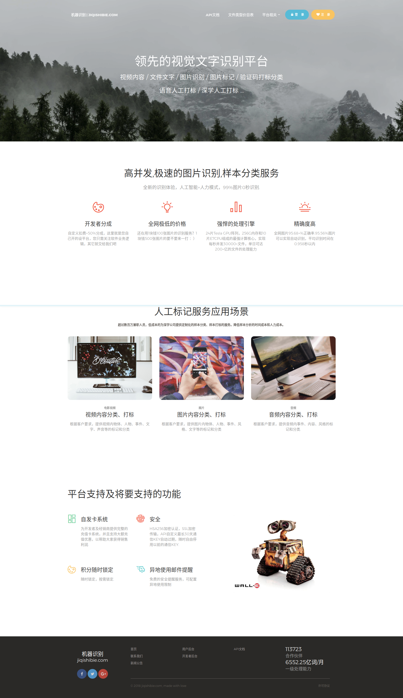
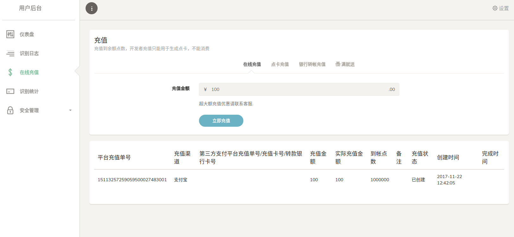
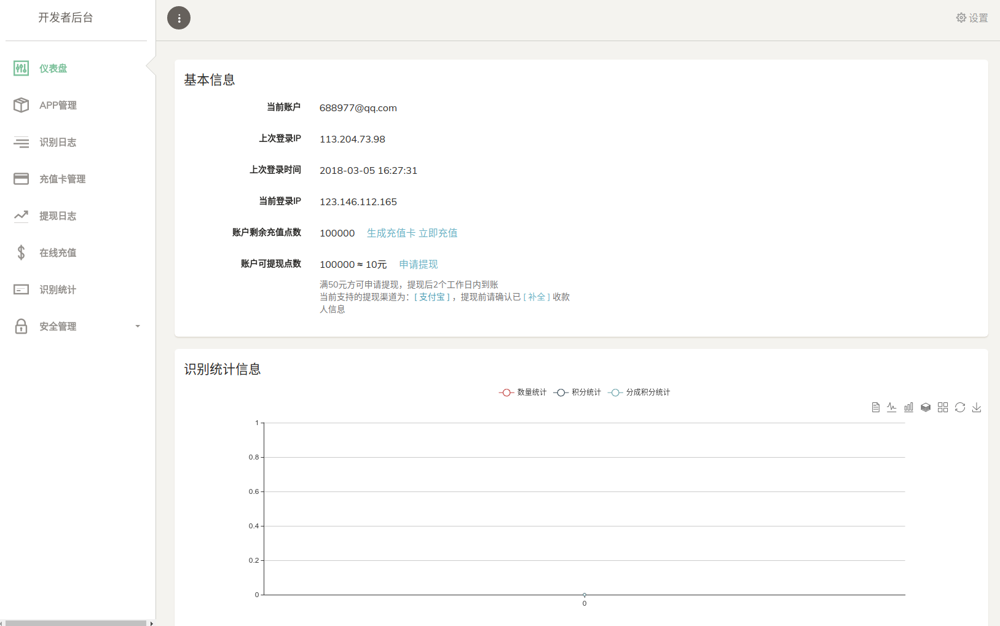
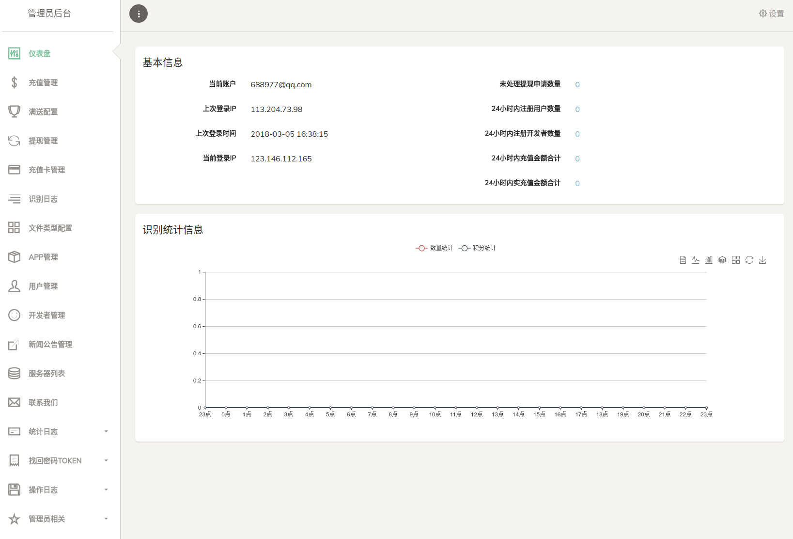

## 基于laravel开发的图片识别平台管理系统源码
此项目是整个AI图片 识别项目 的业务网站和客户后台管理端

原本是作为商业项目开发的，但项目未上线就宣告结束了，出于共同学习的目的，开源此项目

因项目未真正上线运营，所以有一些不足或考虑不周全之处请自行忽略，若发现错误，还请指正。

基于Lumen写的高性能API源码请移步至 https://github.com/hookover/aiocr-api.git

整个图形识别系统的识别处理核心是基于深度学习模型使用大量样本图片数据进行训练得到最终的识别模型，
采用python语言开发，未完工，未开源，有兴趣的同学可以做一下。

## 技术目标
稳定安全、最佳实践方案

## 其它说明
管理员管理后台很多页面采用代码生成器生成

数据统计报表数据采集使用的是 MYSQL事件+存储过程，每5分钟统计一次整个系统产生的识别数据,每天统计开发者和用户的数据

## 安装
     1、 为php安装此扩展 https://github.com/hookover/php_snowflake.git
     2、 克隆此代码并composer安装代码依赖
     3、 配置nginx/apache 参考lumen的配置
     4、 cp .env.example .env       #并在文件中配置管理端域名和客户域名
     5、 php artisan migrate
     6、 php artisan db:seed
     
     管理员网站登录URL地址 http://域名/go-to-home
     默认开发者、用户、管理员账户： username:688977@qq.com,password:aa111111

## 站点功能图

